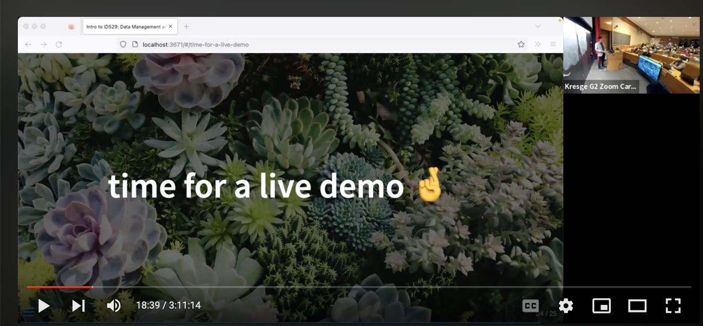
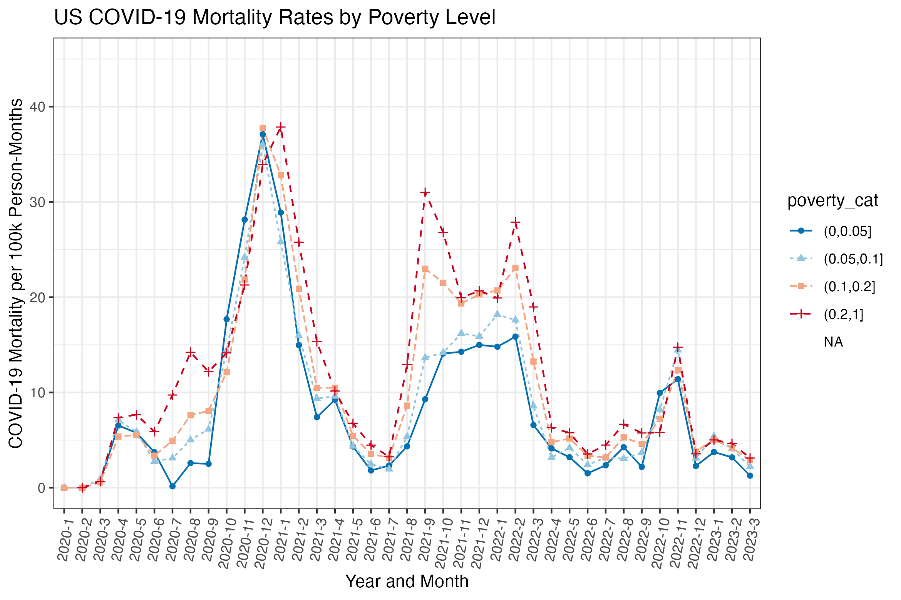

# live-demo-covid19-and-poverty

This repository contains the script created as part of the live demo for ID529. 

You can check out the code here: 
<a href="live_demo_covid19_and_poverty.R">live_demo_covid19_and_poverty.R</a>

A video recording of the live demo is available on YouTube (start: at 18 minutes, end: 1 hour 06 minutes)

https://youtu.be/yxvROGxWys0?t=1099

Here's the graphic produced from the live demo:

